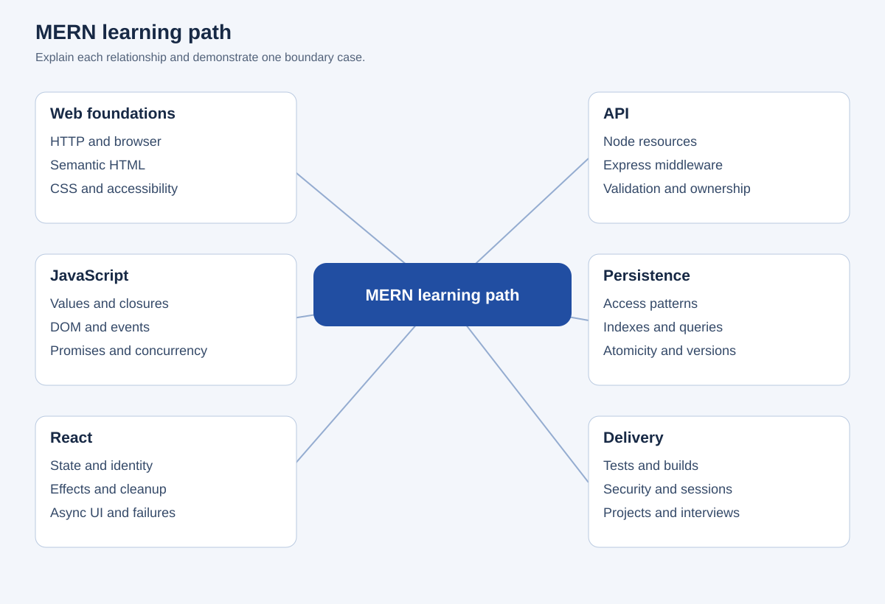

# MERN Stack Knowledge Base

Learn the web, build full-stack JavaScript applications, prepare for product-company and startup interviews, and understand the engineering decisions behind reliable systems. This living open-source knowledge base is for beginners, developers, interview candidates, and trainers. The institutional curriculum is one optional view, and useful original URLs remain available.

[Start the 80/20 route](knowledge-base/paths/80-20-mern-developer.md) · [Search concepts](knowledge-base/explorer.html) · [All topics](knowledge-base/INDEX.md) · [Interview handbook](interview-handbook/README.md) · [Project ladder](knowledge-base/projects/README.md) · [Downloads](interview-handbook/downloads/README.md)

## Learn broadly; practice the essentials deeply

Every mapped concept has a priority. Focus first on P0 and P1, implement and debug real behavior, then return to specialized topics when a requirement needs them.

| Priority | Meaning | Study approach |
| --- | --- | --- |
| 🔥 P0 | Essential / Master | Repeated implementation, debugging, and explanation |
| ⭐ P1 | Highly Important | Understand well and apply in a project |
| 📚 P2 | Useful | Learn when the application calls for it |
| 🧩 P3 | Advanced / Specialized | Investigate constraints and alternatives |
| 🔬 P4 | Reference / Experimental | Evaluate status and compatibility before use |

The current catalog has **25 authored guides and 375 mapped concepts**. **64 concepts have direct worked examples; 311 have reference definitions and connected resources awaiting deeper treatment.** These counts describe current evidence, not complete technology knowledge or mastery. See the [coverage map and priority distribution](knowledge-base/COVERAGE.md) and [remaining work](knowledge-base/REMAINING_WORK.md).

| Area | Connected guides |
| --- | --- |
| Web foundations | [Foundations](knowledge-base/topics/foundations.md), [HTML](knowledge-base/topics/html.md), [CSS](knowledge-base/topics/css.md) |
| JavaScript ecosystem | [JavaScript](knowledge-base/topics/javascript.md), [async](knowledge-base/topics/async.md), [browser APIs](knowledge-base/topics/browser.md), [TypeScript](knowledge-base/topics/typescript.md), [Git](knowledge-base/topics/git.md) |
| Frontend | [React](knowledge-base/topics/react.md), [state management](knowledge-base/topics/state-management.md), [Next.js](knowledge-base/topics/nextjs.md) |
| Backend and data | [Node](knowledge-base/topics/nodejs.md), [Express](knowledge-base/topics/express.md), [MongoDB](knowledge-base/topics/mongodb.md), [Mongoose](knowledge-base/topics/mongoose.md), [SQL](knowledge-base/topics/sql.md), [Redis](knowledge-base/topics/redis.md) |
| Application engineering | [APIs](knowledge-base/topics/api.md), [security](knowledge-base/topics/security.md), [real-time systems](knowledge-base/topics/realtime.md), [testing](knowledge-base/topics/testing.md) |
| Operating and scaling | [DevOps](knowledge-base/topics/devops.md), [cloud](knowledge-base/topics/cloud.md), [software engineering](knowledge-base/topics/engineering.md), [system design](knowledge-base/topics/system-design.md) |

[Ten debugging cases](knowledge-base/debugging/README.md) · [17 cheatsheets](knowledge-base/cheatsheets/README.md) · [Ten Mermaid diagrams](knowledge-base/diagrams/README.md) · [Reviewed primary resources](knowledge-base/resources/README.md)



## Find what you need

| Goal | Resource |
| --- | --- |
| Learn fundamentals | [Web and HTML](interview-handbook/notes/01-web-html.md), [CSS](interview-handbook/notes/02-css.md), [JavaScript](interview-handbook/notes/03-javascript.md) |
| Understand MERN | [React](interview-handbook/notes/04-react.md), [Node and Express](interview-handbook/notes/05-node-express.md), [MongoDB](interview-handbook/notes/06-mongodb.md) |
| Build reliable apps | [Security](interview-handbook/notes/07-security.md), [testing](interview-handbook/notes/08-testing.md), [design](interview-handbook/notes/09-design.md), [TypeScript](interview-handbook/notes/10-typescript.md) |
| Technical interviews | [100 answered questions](interview-handbook/questions/index.md): 30 Easy, 40 Medium, 30 Hard |
| Debugging interviews | [24 scenario questions with diagnosis and verification](interview-handbook/scenarios/README.md) |
| Machine coding | [16 timed exercises](interview-handbook/machine-coding/README.md), [rubric](interview-handbook/machine-coding/rubric.md), [source implementations](projects/interview-ready/README.md) |
| Company preparation | [Company and startup playbooks](interview-handbook/companies/README.md), [project defense](interview-handbook/companies/project-defense.md) |
| Coding patterns | [DSA patterns](interview-handbook/dsa/README.md), [tested JavaScript utilities](projects/interview-ready/js-toolkit/README.md) |
| Visual revision | [Six SVG and editable Mermaid mind maps](interview-handbook/mindmaps/README.md) |
| Offline study | [PDF handbook, Word plan, Excel and CSV trackers](interview-handbook/downloads/README.md) |
| Online progress | [Native Google Sheets tracker](https://docs.google.com/spreadsheets/d/1qv2QV0GggbD07a_JYlhir__9PxiIjKEQEbz103HR0H0/edit) |
| External courses | [28 curated resources](interview-handbook/resources/README.md) with level, access, and suggested use |

Company playbooks link official guidance and label original practice recommendations. They do not predict questions or guarantee selection. External resources retain their own licenses and include free documentation plus clearly labeled optional paid practice.

## Runnable source projects

| Application | Setup and source | Learning focus |
| --- | --- | --- |
| Six beginner apps | [Web learning lab](projects/knowledge-base/learning-lab/README.md) | Calculator, undoable todo, quiz, weather, local notes, exact-cent expenses |
| MERN task board | [MERN workspace](projects/interview-ready/mern-workspace/README.md) | Sessions, ownership, status workflow, atomic version conflicts |
| MERN reading list | [MERN workspace](projects/interview-ready/mern-workspace/README.md) | URL validation, per-user uniqueness, persistent CRUD |
| MERN expense tracker | [MERN workspace](projects/interview-ready/mern-workspace/README.md) | Exact amounts, valid dates, account aggregates |
| Accessible UI lab | [HTML CSS JS source](projects/interview-ready/ui-lab/README.md) | Accordion, modal, filters, undo, keyboard focus |
| JavaScript toolkit | [Source and tests](projects/interview-ready/js-toolkit/README.md) | Debounce, LRU, emitter, promise pool, algorithms |

The three MERN apps share one runnable package and authentication foundation, with distinct domain behavior. Setup, tests, and limitations are documented. The [20-project ladder](knowledge-base/projects/README.md) contains requirements, architecture, schema, API specification, testing, deployment, and explicit status: seven learning implementations, two shared MERN foundations, and eleven specifications awaiting implementation. Production scope requires evidence against the [production gate](knowledge-base/projects/PRODUCTION_GATE.md). The original [150 mini-project briefs](PROJECT_INDEX.md) remain available.

## Study in the browser

```bash
git clone https://github.com/venkatesh7975/NEC_MERN_Notes_3rd_year.git
cd NEC_MERN_Notes_3rd_year
python -m http.server 8000
```

Open `http://localhost:8000/knowledge-base/explorer.html` to search concepts, filter priority/difficulty/depth, read guides, track reviewed concepts, and export progress. Open `/projects/knowledge-base/learning-lab/` for six apps, `/interview-handbook/study.html` for answer practice, or `/` for the preserved portal. Serving over HTTP allows modules and JSON data to load consistently. Progress stays in your browser; export it for backup.

For MERN apps, follow the [workspace setup](projects/interview-ready/mern-workspace/README.md). It requires Node 22.12 or newer and MongoDB. The explorer and UI lab need no npm installation.

## Learning paths

[80/20 MERN](knowledge-base/paths/80-20-mern-developer.md) · [Comprehensive MERN route](knowledge-base/paths/complete-mern-developer.md) · [Frontend](knowledge-base/paths/frontend-developer.md) · [React](knowledge-base/paths/react-developer.md) · [Backend](knowledge-base/paths/backend-developer.md) · [Node.js](knowledge-base/paths/nodejs-developer.md) · [Full-stack engineer](knowledge-base/paths/full-stack-engineer.md) · [Interview preparation](knowledge-base/paths/interview-preparation.md) · [Production engineer](knowledge-base/paths/production-engineer.md) · [Advanced MERN](knowledge-base/paths/advanced-mern-engineer.md)

Each route has connected topics, practice, and exit evidence. The comprehensive route is a destination; the coverage map identifies present depth. For time-bound preparation, use the [12-week, 30-day, and seven-day roadmaps](interview-handbook/roadmaps/README.md). The [classroom guide](CLASSROOM_GUIDE.md) remains an optional institutional route.

Read, explain without notes, implement, test a boundary, and defend a tradeoff. Record evidence and extend source projects yourself before claiming portfolio ownership.

## Quality checks

```bash
npm test
npm run build:knowledge
npm run check:knowledge
npm run check:handbook
cd projects/interview-ready/mern-workspace
npm ci
npm test
npm run build
```

API checks use real disposable MongoDB. [Knowledge-base verification](knowledge-base/VERIFICATION.md) and [interview verification](interview-handbook/VERIFICATION.md) distinguish executed checks from documentation review. [Architecture](knowledge-base/ARCHITECTURE.md) explains generation, metadata, and future website features.

## Original classroom materials

[Classroom guide](CLASSROOM_GUIDE.md) · [Curriculum](CURRICULUM.md) · [Notes](notes) · [Daily practice](daily-practice) · [Assignments](TASK_INDEX.md) · [Project briefs](PROJECT_INDEX.md) · [Example execution status](resources/example-status.md)

Contributions should add correct explanations, clear acceptance criteria, runnable source when promised, and meaningful checks. See [contributing](CONTRIBUTING.md), [code of conduct](CODE_OF_CONDUCT.md), [security reporting](SECURITY.md), and [resource policy](knowledge-base/resources/POLICY.md). Repository content uses the [MIT license](LICENSE); linked resources keep their own licenses.

[Repository audit](REPOSITORY_AUDIT.md) · [Migration map](knowledge-base/MIGRATION_MAP.md) · [Coverage](knowledge-base/COVERAGE.md) · [Remaining work](knowledge-base/REMAINING_WORK.md)

The offline PDF, Word, Excel, and CSV exports currently cover the interview handbook. The Google Sheet belongs to the owner's connected account and has not been made publicly accessible. [Media verification scope](knowledge-base/resources/VIDEOS.md) identifies video-curation gaps without padding recommendations.
