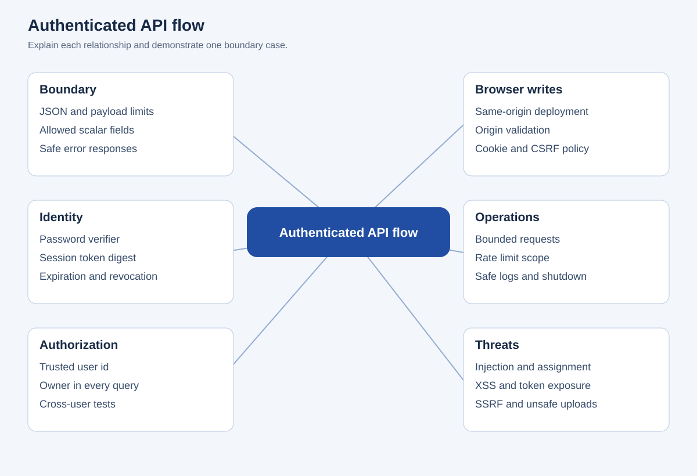
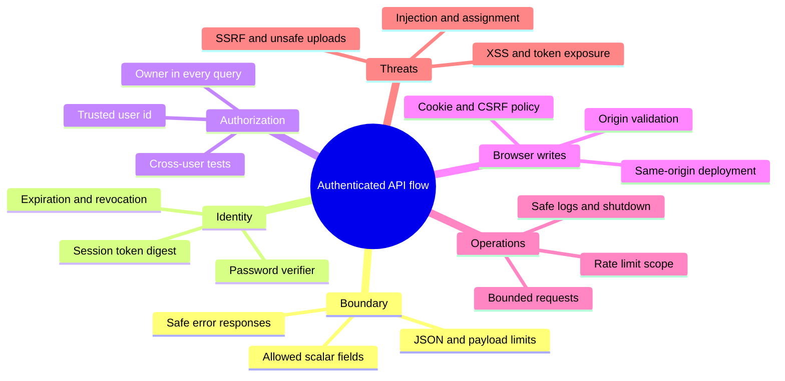

# Authenticated API flow

## Editable mind map

## Text outline

### Boundary

- JSON and payload limits
- Allowed scalar fields
- Safe error responses

### Identity

- Password verifier
- Session token digest
- Expiration and revocation

### Authorization

- Trusted user id
- Owner in every query
- Cross-user tests

### Browser writes

- Same-origin deployment
- Origin validation
- Cookie and CSRF policy

### Operations

- Bounded requests
- Rate limit scope
- Safe logs and shutdown

### Threats

- Injection and assignment
- XSS and token exposure
- SSRF and unsafe uploads
