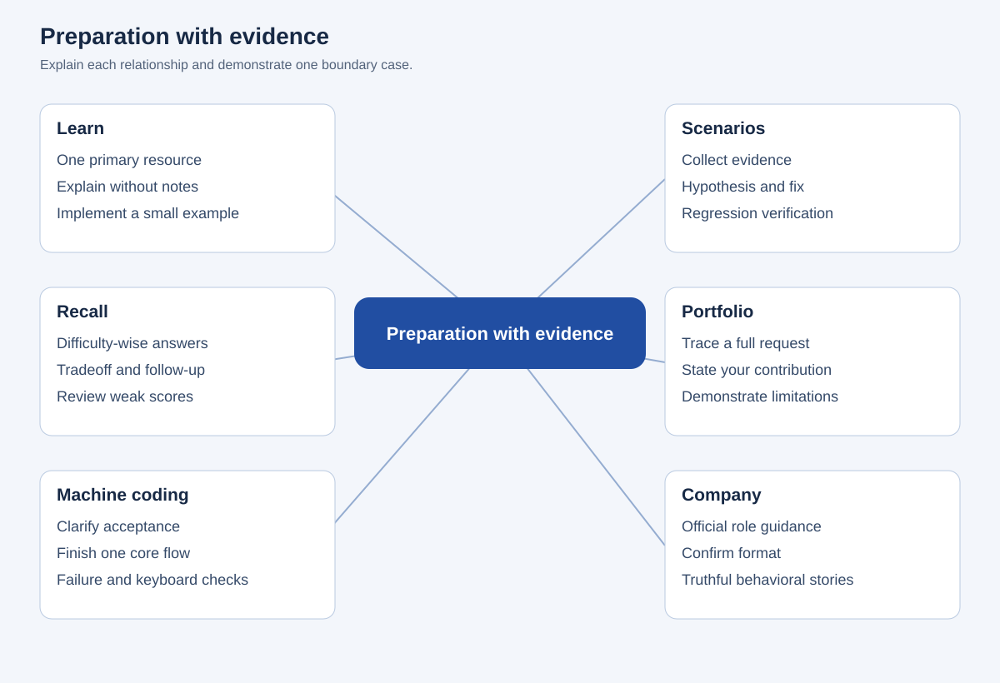
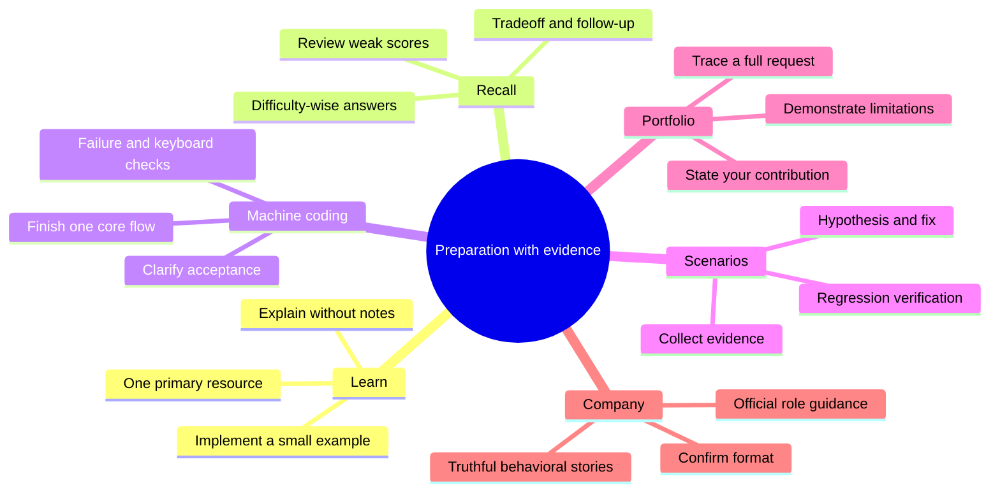

# Preparation with evidence

## Editable mind map

## Text outline

### Learn

- One primary resource
- Explain without notes
- Implement a small example

### Recall

- Difficulty-wise answers
- Tradeoff and follow-up
- Review weak scores

### Machine coding

- Clarify acceptance
- Finish one core flow
- Failure and keyboard checks

### Scenarios

- Collect evidence
- Hypothesis and fix
- Regression verification

### Portfolio

- Trace a full request
- State your contribution
- Demonstrate limitations

### Company

- Official role guidance
- Confirm format
- Truthful behavioral stories
