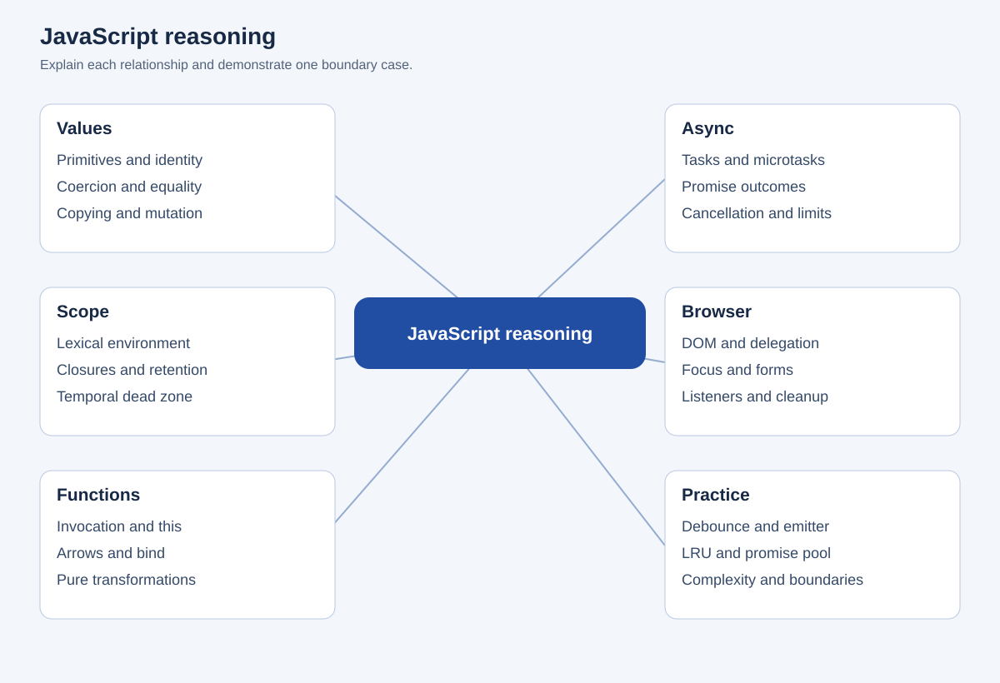
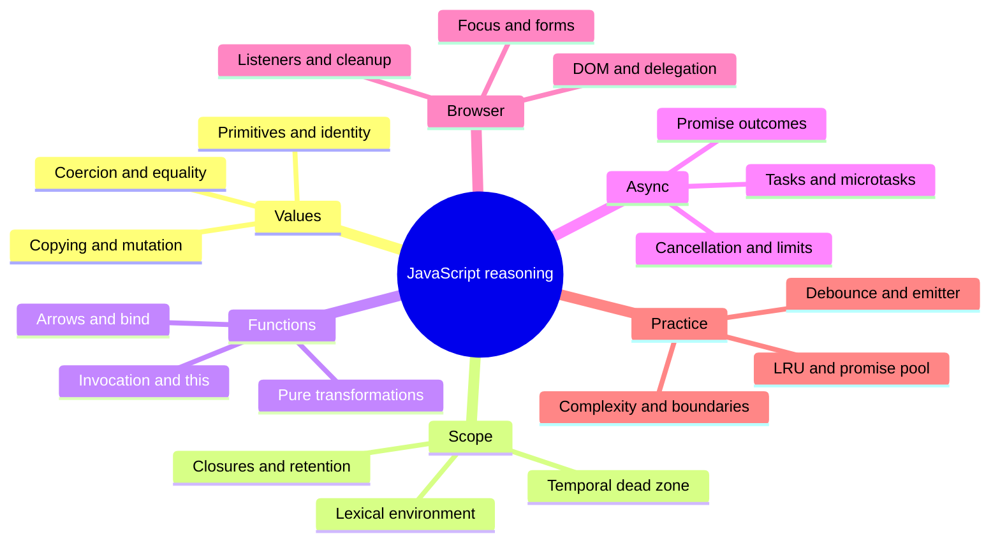

# JavaScript reasoning

## Editable mind map

## Text outline

### Values

- Primitives and identity
- Coercion and equality
- Copying and mutation

### Scope

- Lexical environment
- Closures and retention
- Temporal dead zone

### Functions

- Invocation and this
- Arrows and bind
- Pure transformations

### Async

- Tasks and microtasks
- Promise outcomes
- Cancellation and limits

### Browser

- DOM and delegation
- Focus and forms
- Listeners and cleanup

### Practice

- Debounce and emitter
- LRU and promise pool
- Complexity and boundaries
