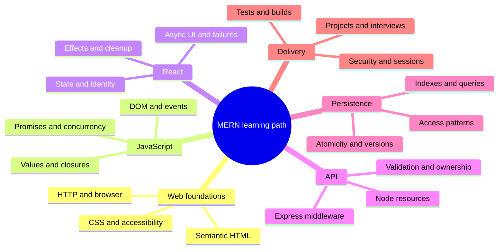

# MERN learning path

## Editable mind map

## Text outline

### Web foundations

- HTTP and browser
- Semantic HTML
- CSS and accessibility

### JavaScript

- Values and closures
- DOM and events
- Promises and concurrency

### React

- State and identity
- Effects and cleanup
- Async UI and failures

### API

- Node resources
- Express middleware
- Validation and ownership

### Persistence

- Access patterns
- Indexes and queries
- Atomicity and versions

### Delivery

- Tests and builds
- Security and sessions
- Projects and interviews
