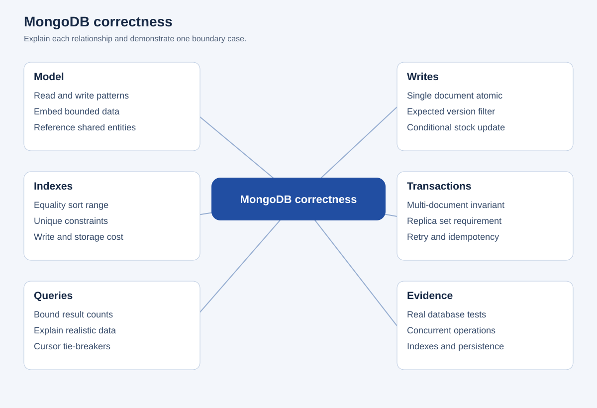
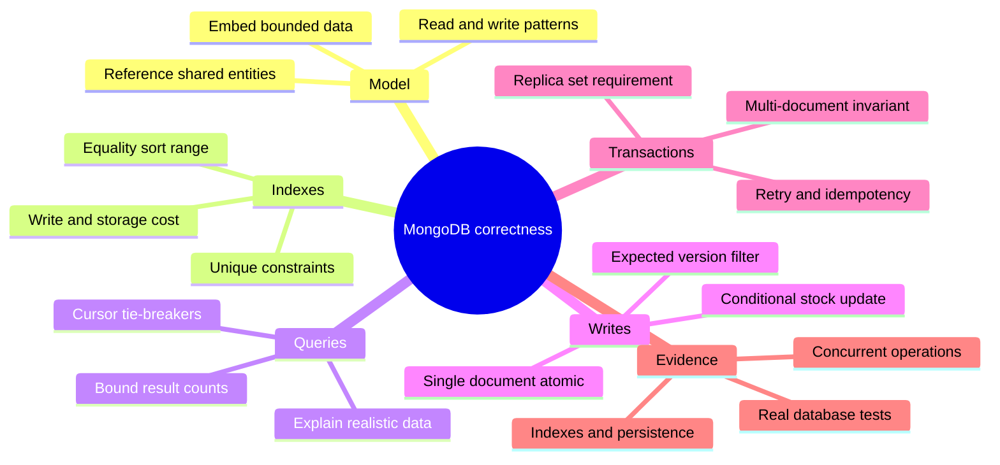

# MongoDB correctness

## Editable mind map

## Text outline

### Model

- Read and write patterns
- Embed bounded data
- Reference shared entities

### Indexes

- Equality sort range
- Unique constraints
- Write and storage cost

### Queries

- Bound result counts
- Explain realistic data
- Cursor tie-breakers

### Writes

- Single document atomic
- Expected version filter
- Conditional stock update

### Transactions

- Multi-document invariant
- Replica set requirement
- Retry and idempotency

### Evidence

- Real database tests
- Concurrent operations
- Indexes and persistence
