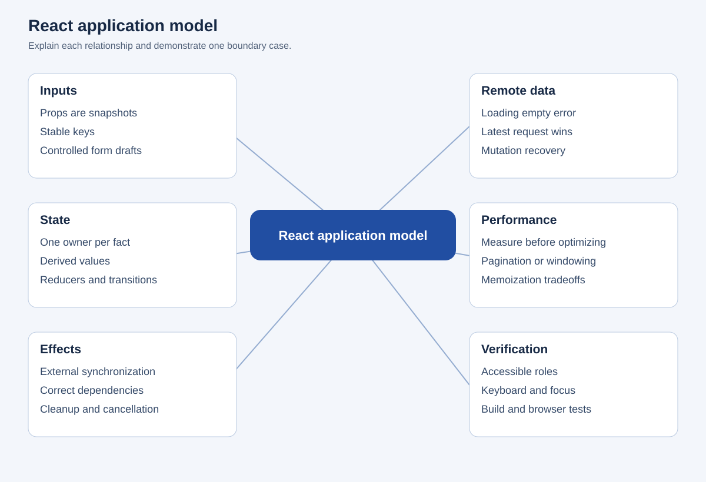
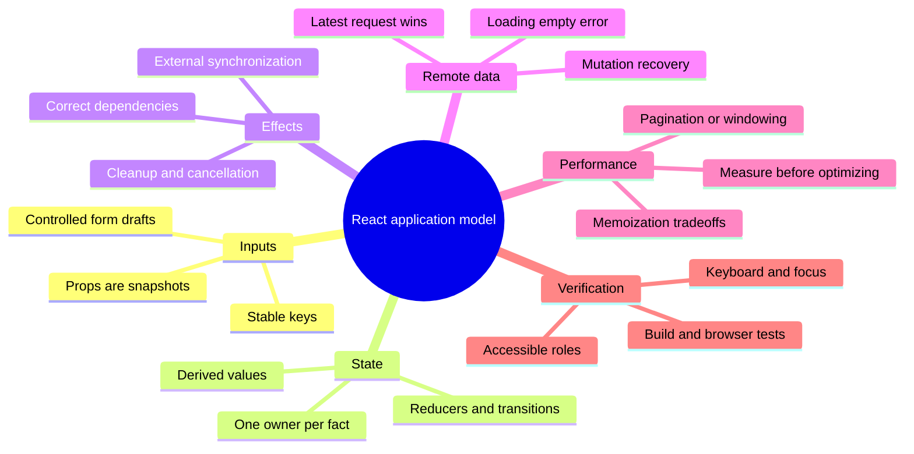

# React application model

## Editable mind map

## Text outline

### Inputs

- Props are snapshots
- Stable keys
- Controlled form drafts

### State

- One owner per fact
- Derived values
- Reducers and transitions

### Effects

- External synchronization
- Correct dependencies
- Cleanup and cancellation

### Remote data

- Loading empty error
- Latest request wins
- Mutation recovery

### Performance

- Measure before optimizing
- Pagination or windowing
- Memoization tradeoffs

### Verification

- Accessible roles
- Keyboard and focus
- Build and browser tests
