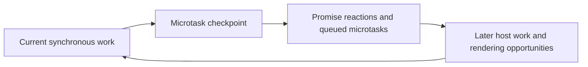
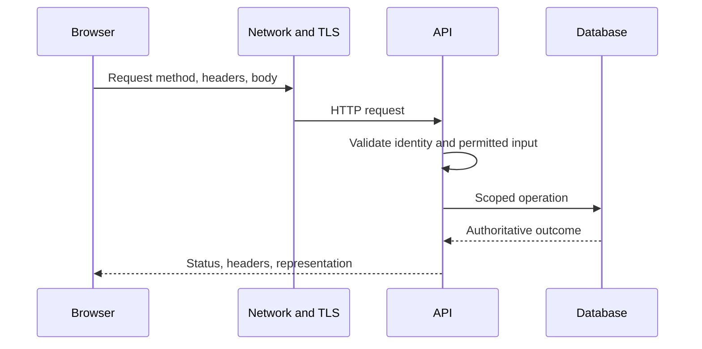
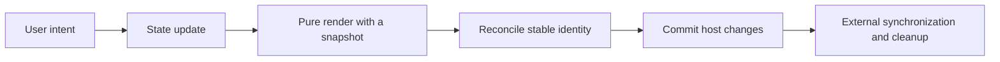
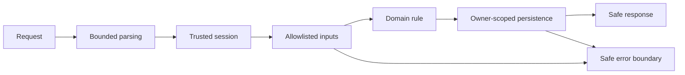
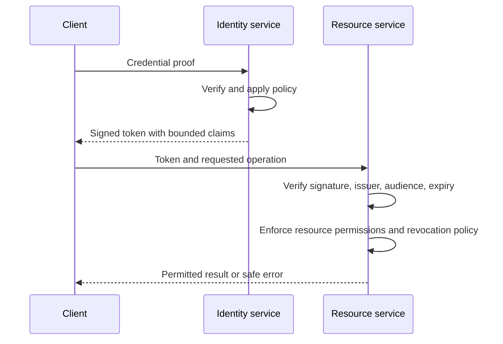
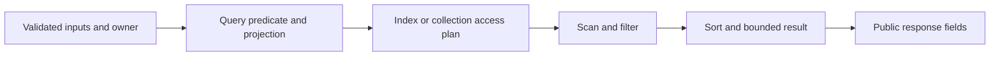
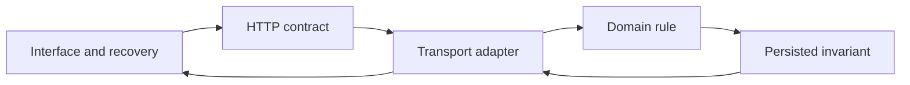
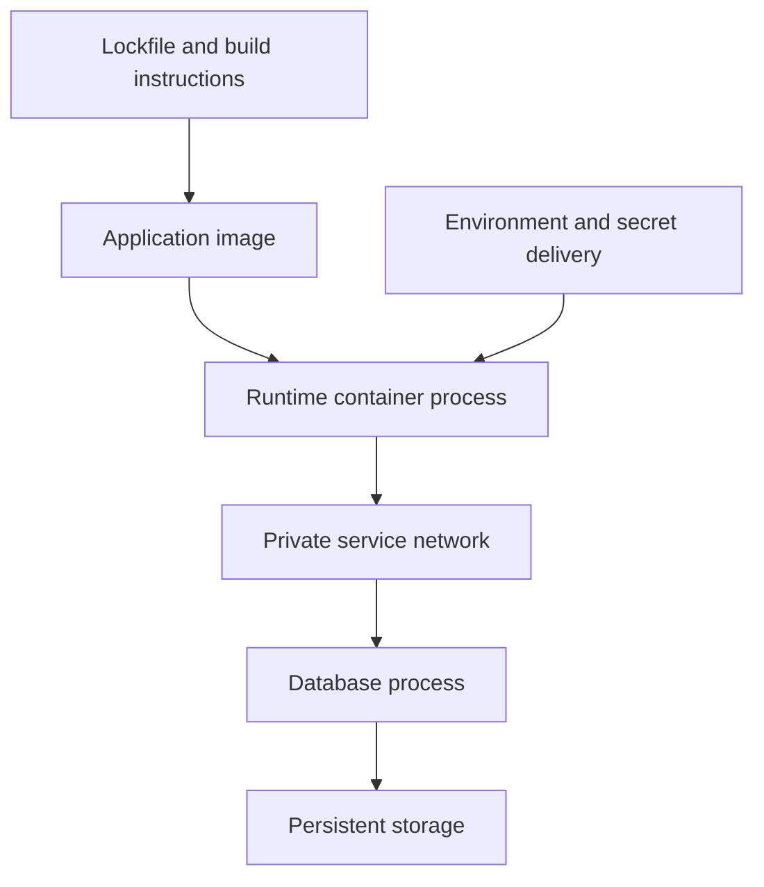
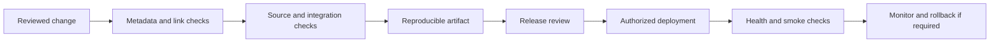
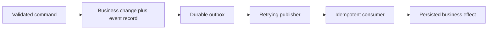

# Mental-model diagrams

Each diagram has a text explanation and a topic link. These are simplified models, not implementation-specific timing or deployment guarantees.

## JavaScript event loop

Current work completes before its queued reactions. Continually adding microtasks can delay other work. Browser scheduling and Node phases differ. [Async guide](../topics/async.md)

## HTTP request lifecycle

Transport carries a request; application boundaries validate and authorize it. A status response is different from a transport failure. [Foundations](../topics/foundations.md)

## React rendering

Rendering may be evaluated again; commands belong to explicit intent handlers. Effects describe external connections. [React](../topics/react.md)

## Express middleware

Order controls who can continue or terminate processing. Rejected returned Promises in Express 5 reach error handling. [Express](../topics/express.md)

## JWT authentication model

Signing protects integrity, not payload confidentiality. Revocation and refresh policy need separate design. The current learning workspace uses revocable server sessions instead of JWT. [Security](../topics/security.md)

## MongoDB query flow

Compare examined keys/documents with returned records using representative data. Index existence does not prove all queries are efficient. [MongoDB](../topics/mongodb.md)

## REST architecture

Each boundary has different evidence: UI recovery, HTTP errors, domain behavior, and real database semantics. [API](../topics/api.md)

## Docker architecture

An image is not a running process, and a volume lifetime differs from a container lifetime. [DevOps](../topics/devops.md)

## CI/CD pipeline

CI success establishes configured checks; actual deployment and recovery need separate evidence. [Git](../topics/git.md), [DevOps](../topics/devops.md)

## Outbox and retry

The shared transaction prevents a state/event-record gap. Retried publication can duplicate delivery; the consumer establishes a durable effect invariant. [System design](../topics/system-design.md)
